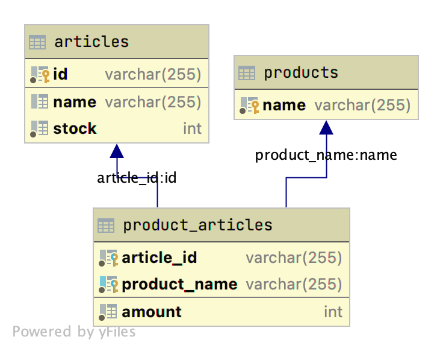
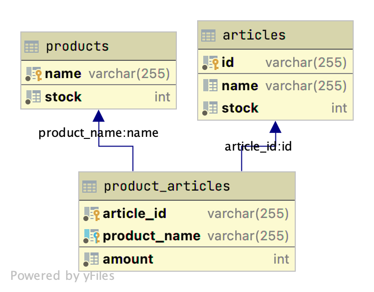

# Run the application

The application can be run using docker in combination with a mysql image (more details in the docker-compose.yml file).
To run the application just:

<code>
docker compose up
</code>

Endpoint documentation can be found at:

http://localhost:8080/swagger-ui/

During the initialization process the mysql database is created using the script found at ./db/schema.sql

The inventory is also initialized using the two json files found at ./example folder.

Two different solutions are proposed to solve this problem, each having its own advantages and drawbacks.
Each solution has been uploaded to the repository as an independent branch. The branch masters contains the 
last solution explained (solution2).

## Solution1
The solution1 is the simplest. The problem definition states that the stock available for each product is the
result of the stock of each component (article). That means that the state of the product's availability depends on
the state of its components availability. 

In this solution, each time a Product is queried, the application gathers
the availability of its components and calculate it dynamically. When a product is sold, the stock of its 
components is reduced, and the next users querying about the stock of the product immediately get the new
stock state.

The main advantage of this solution is that
- The stock information is consistent. The stock of the products is dynamically calculated based on the stock of its component, 
  therefore there is only one source of information (the stock of the articles).
- It is only necessary to update the value of the component's stock.
- The application is less complex.

The main drawback of this approach is:
- Given that the product's stock is calculated dynamically, the scalability of the application is poor because for each
query you have to retrieve the information of its components.

This solution fits well for applications with a few products and components and that does not need to scale. It also fits
where the sales are a lot more common than the queries.

## Solution2
The aim of this solution was to overcome the drawback of the solution1, the scalability issues. For this purpose, the stock
of the products have been separated from the stock of the articles, so that querying for a product's stock now only involves
querying one table in the database.

With this modification we have performed a database denormalization, and we have two states (product stock and components stock)
that could be inconsistent. Each time a product is sold, then articles stock is reduced, and the product stock is recalculated.
It is a complicated process because you have to update not only the stock of the product you have sold, but also the stock
of the rest of the products that share with it any component. This process is a lot more complicated compared to the solution1,
and depending on the implementation, the product's stock could be eventually consistent.

The advantages of this solution is:
- A lot faster product queries and better overall db performance if the application requires it.

The drawbacks are:
- The stock now is saved in two different states.
- Much slower updates (sales)
- Depending on the implementation, the product's stock could be eventually consistent. That means that the product stock value
  that you are returning to the users could be outdated for a short period.
- More complex solution

# Code Assignment Description

## Intro

This assignment will be used as a discussion during a technical interview. The primary values for the code we look for
are: simplicity, readability, maintainability, testability. It should be easy to scan the code, and rather quickly
understand what it’s doing. Pay attention to naming. You may choose any coding language, and we look forward to
discussing your choice.

## The Task

The assignment is to implement a warehouse software. This software should hold articles, and the articles should contain
an identification number, a name and available stock. It should be possible to load articles into the software from a
file, see the attached inventory.json. The warehouse software should also have products, products are made of different
articles. Products should have a name, price and a list of articles of which they are made from with a quantity. The
products should also be loaded from a file, see the attached products.json. The warehouse should have at least the
following functionality;

* Get all products and quantity of each that is an available with the current inventory
* Remove(Sell) a product and update the inventory accordingly
